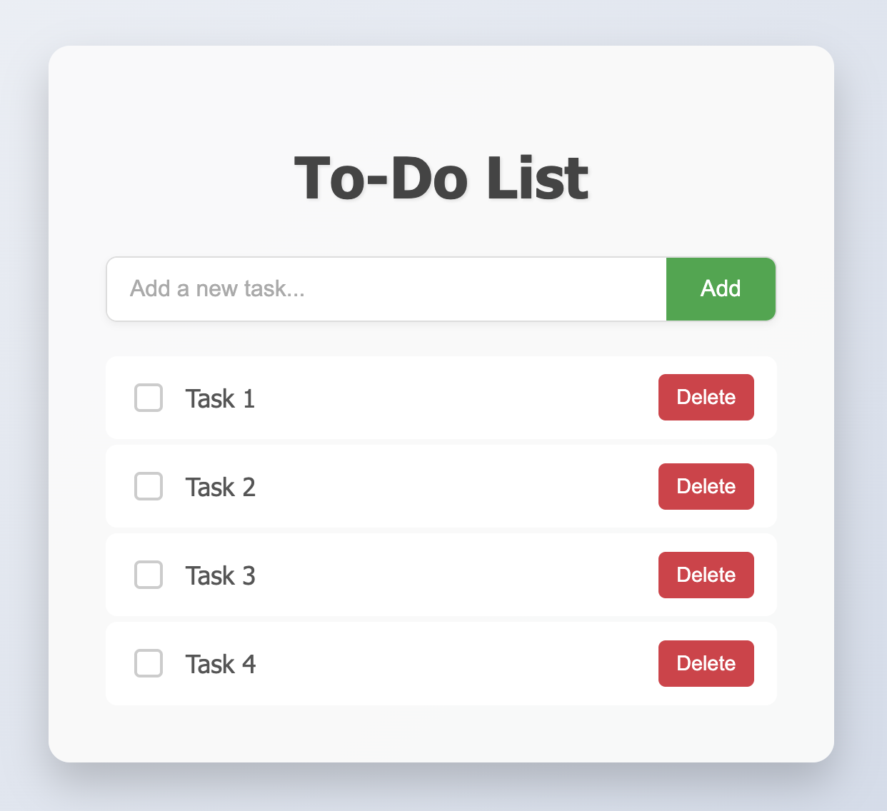

# 📝 Interactive To-Do App

A clean and interactive To-Do List web app built with **HTML**, **CSS**, and **JavaScript**. This app lets users add, complete, and delete tasks—and it saves your list in **Local Storage** so your data stays even after a page reload.

---

## 🚀 Features

- ✅ Add new tasks to your to-do list
- ✅ Mark tasks as completed
- ✅ Delete individual tasks
- 💾 Persistent data storage with `localStorage`
- ⚡ Smooth and responsive UI

---

## 🔧 Built With

- HTML5
- CSS3
- Vanilla JavaScript (ES6)

---

## 📸 Screenshot

---

## 📂 Folder Structure

/interactive-todo-app
│
├── index.html # Main HTML file
├── style.css # App styling
├── script.js # App logic and localStorage
├── screenshot.png # App preview
└── README.md # Project documentation
